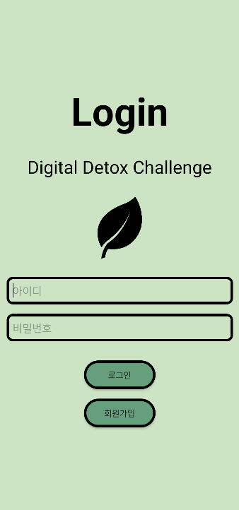
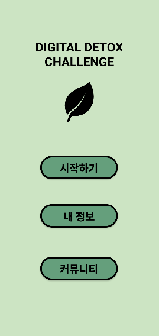
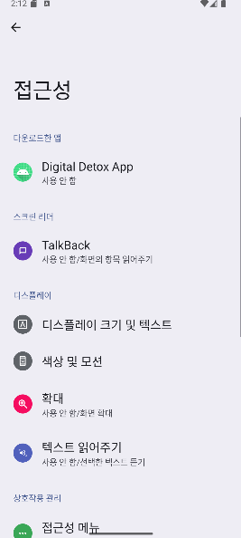
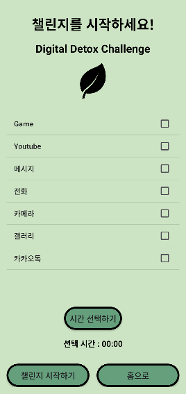
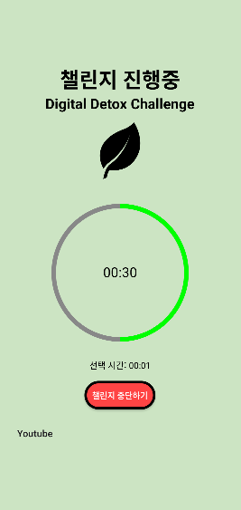
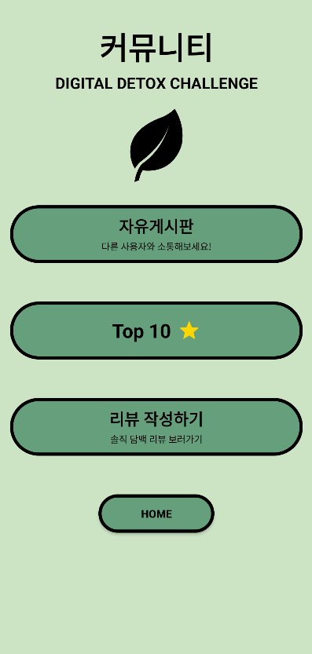

# 📵 Digital Detox  
사용 습관을 개선하고 디지털 웰빙을 유도하는 안드로이드 기반 스마트폰 앱 차단/통계 앱

---

## 📌 프로젝트 개요

- **프로젝트명** : Digital Detox
- **개발 기간** : 2024.09 ~ 2024.12
- **개발 환경** : Android Studio (Java)
- **목표** : 스마트폰 사용 시간과 앱 사용을 효과적으로 제한하여 디지털 습관 개선을 도와주는 디지털 디톡스 앱 개발
- **개발 인원** : 5인 팀 프로젝트
- **협업 방식** : 역할 분담 + 주간 회의, GitHub를 통한 최종 코드 통합

---

## 🛠 기술 스택

- **개발 언어** : Java (Android SDK)
- **개발 환경** : Android Studio Hedgehog (2023.1.1.28)
- **테스트 환경** : Medium Phone API 34(Emulator)
- **백엔드 / API 연동** : Firebase Authentication + Firestore 사용
- **버전 관리 및 협업** : Git / GitHub + 주간 회의로 코드 통합

---

## 🔑 기능 구현

### 💻 회원가입, 로그인
- 회원 가입 시 비밀번호 firestore에 암호화되어 저장

### 🚨 앱 접근 제한
- 접근성 서비스(AppBlockAccessibilityService)로 지정한 앱 실행 시 자동 차단
- 특정 앱 차단 타이머 설정
- AndroidManifest.xml에 접근성 서비스 등록 및 사용자 설정 활성화 유도
  
### ⏱️ 스마트폰 사용 시간 측정
- UsageStatsManagerHelper로 앱 사용 시간 데이터 수집
- MPAndroidChart 라이브러리로 일간 앱 사용시간 시각화

### 🙍‍♂️ 커뮤니티 및 TOP10
- 유저들 간 정보를 공유할 수 있는 커뮤니티 조성(게시판)
- 디톡스 진행시간이 가장 높은 10명의 유저 닉네임 상시 게시

### 🧯 Firebase 연동
- 회원가입 및 로그인, 사용자 정보 저장
- 커뮤니티 게시글 저장, 수정, 삭제 기능 구현

---

## 👨‍👩‍👧‍👦 팀원 및 역할

| 이름 | 역할 |
|-------|------|
| 김용우 | 팀장, 보고서 작성, 내 정보, 전체 UI |
| **최영찬 (본인)** | 스마트폰 앱 차단 기능, 앱 접근성 관리, 통계 화면 및 MPAndroidChart 적용, 전체 UI |
| 임수정 | Firebase 연동 및 Firestore 설정, 소스코드 관리 |
| 한민주 | 로그인, 회원가입, 디톡스 진행시간에 따른 사용자 등급 부여 기능 |
| 조준희 | 커뮤니티 기능 |

---

## 📱 앱 UI

<table>
  <tr>
    <td align="center">로그인</td>
    <td align="center">홈 화면</td>
  </tr>
  <tr>
    <td></td>
    <td></td>
  </tr>
  <tr>
    <td align="center">접근성 설정 화면 이동</td>
    <td align="center">디톡스 할 앱 선택</td>
  </tr>
  <tr>
    <td></td>
    <td></td>
  </tr>
  <tr>
    <td align="center">디톡스 진행</td>
    <td align="center">커뮤니티</td>
  </tr>
  <tr>
    <td></td>
    <td></td>
  </tr>
</table>
